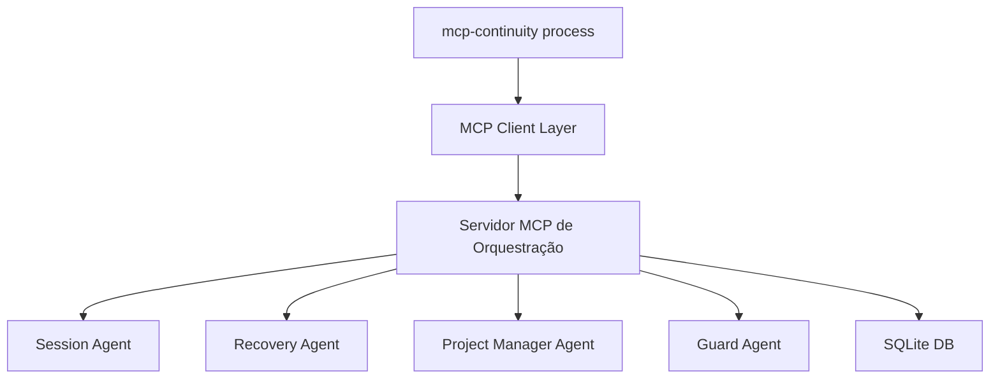

# 🔌 Protocolo de Comunicação MCP - Hub Local Lucas

## 2️⃣ **INTERAÇÃO mcp-continuity process COM SERVIDOR DE ORQUESTRAÇÃO**

### **Arquitetura de Comunicação**


### **🔄 Tipos de Mensagens MCP e Payloads**

#### **2.1 INICIAR/PARAR SESSÃO**

##### **Iniciar Sessão:**
```json
// Cliente → Servidor
{
  "jsonrpc": "2.0",
  "id": 1,
  "method": "tools/call",
  "params": {
    "name": "session_start_session",
    "arguments": {
      "project_name": "luaraujo",
      "context_hint": "desenvolvimento mobile app",
      "restore_from": "last_session" // opcional
    }
  }
}

// Servidor → Cliente  
{
  "jsonrpc": "2.0",
  "id": 1,
  "result": {
    "content": [
      {
        "type": "text",
        "text": "Session started successfully",
        "data": {
          "session_id": "lucas-luaraujo-20250528-1930",
          "project_context": {
            "name": "luaraujo",
            "status": "active", 
            "last_update": "2025-05-28T13:44:00Z",
            "progress": 85,
            "next_action": "CORREÇÃO NESTED SCROLL"
          },
          "restored_context": {
            "timeline": [...],
            "pending_tasks": [...],
            "critical_missions": [...]
          }
        }
      }
    ]
  }
}
```

##### **Parar Sessão:**
```json
// Cliente → Servidor
{
  "jsonrpc": "2.0", 
  "id": 2,
  "method": "tools/call",
  "params": {
    "name": "session_end_session",
    "arguments": {
      "session_id": "lucas-luaraujo-20250528-1930",
      "save_state": true,
      "backup_level": "emergency" // normal, emergency, full
    }
  }
}

// Servidor → Cliente
{
  "jsonrpc": "2.0",
  "id": 2, 
  "result": {
    "content": [
      {
        "type": "text",
        "text": "Session ended and backed up",
        "data": {
          "session_id": "lucas-luaraujo-20250528-1930",
          "backup_id": "backup_20250528_193045",
          "backup_location": "/emergency-backups/luaraujo_emergency_20250528_193045",
          "session_duration": "2h 15m",
          "actions_performed": 23,
          "state_preserved": true
        }
      }
    ]
  }
}
```

#### **2.2 SALVAR/RECUPERAR ESTADO JSON**

##### **Salvar Estado:**
```json
// Cliente → Servidor
{
  "jsonrpc": "2.0",
  "id": 3,
  "method": "tools/call", 
  "params": {
    "name": "session_save_state",
    "arguments": {
      "session_id": "lucas-luaraujo-20250528-1930",
      "state_data": {
        "current_focus": "CORREÇÃO NESTED SCROLL",
        "context": {
          "file_changes": ["Chapter4Screen.js", "InvestmentGrowthChart.js"],
          "decisions_made": ["remover ScrollView interno", "implementar layout responsivo"],
          "next_steps": ["testar no mobile", "validar UX"]
        },
        "critical_info": {
          "problem_solved": "Nested ScrollView causava conflitos de gesture",
          "solution_applied": "Layout responsivo sem scroll aninhado"
        }
      },
      "metadata": {
        "save_reason": "checkpoint_before_testing",
        "priority": "high"
      }
    }
  }
}

// Servidor → Cliente
{
  "jsonrpc": "2.0",
  "id": 3,
  "result": {
    "content": [
      {
        "type": "text", 
        "text": "State saved successfully",
        "data": {
          "state_id": "state_lucas_20250528_193055",
          "backup_created": true,
          "size_bytes": 2048,
          "checksum": "sha256:abc123...",
          "previous_state_archived": true
        }
      }
    ]
  }
}
```

##### **Recuperar Estado:**
```json
// Cliente → Servidor
{
  "jsonrpc": "2.0",
  "id": 4,
  "method": "tools/call",
  "params": {
    "name": "recovery_auto_recover", 
    "arguments": {
      "session_id": "lucas-luaraujo-20250528-1930", // opcional
      "recovery_mode": "smart", // smart, full, minimal
      "include_context": true,
      "include_timeline": true
    }
  }
}

// Servidor → Cliente  
{
  "jsonrpc": "2.0",
  "id": 4,
  "result": {
    "content": [
      {
        "type": "text",
        "text": "Context recovered successfully",
        "data": {
          "recovered_session": "lucas-luaraujo-20250528-1930",
          "recovery_type": "smart",
          "context": {
            "project": "luaraujo",
            "last_focus": "CORREÇÃO NESTED SCROLL",
            "progress": "Problem solved - nested ScrollView removed",
            "files_modified": ["Chapter4Screen.js", "InvestmentGrowthChart.js"],
            "next_action": "Test on mobile device"
          },
          "timeline": [
            {"time": "19:20", "action": "Identified nested ScrollView problem"},
            {"time": "19:25", "action": "Implemented responsive layout solution"},  
            {"time": "19:30", "action": "Session saved before testing"}
          ],
          "critical_missions": [],
          "orphaned_files": [],
          "system_state": {
            "active_processes": 12,
            "mcp_services": "healthy",
            "disk_space": "adequate"
          }
        }
      }
    ]
  }
}
```

#### **2.3 REGISTRAR INPUT DO USUÁRIO**

```json
// Cliente → Servidor
{
  "jsonrpc": "2.0",
  "id": 5,
  "method": "tools/call",
  "params": {
    "name": "input_registrator_register_input",
    "arguments": {
      "user_input": "preciso corrigir o problema de scroll aninhado no Chapter4 - o ScrollView interno está causando conflitos no mobile",
      "session_id": "lucas-luaraujo-20250528-1930",
      "metadata": {
        "source": "claude_desktop",
        "urgency": "medium",
        "project_context": "luaraujo"
      }
    }
  }
}

// Servidor → Cliente
{
  "jsonrpc": "2.0", 
  "id": 5,
  "result": {
    "content": [
      {
        "type": "text",
        "text": "Input registered and classified",
        "data": {
          "input_id": "input_20250528_193100",
          "classification": {
            "type": "development_request",
            "substantive": true,
            "priority": "medium",
            "estimated_complexity": "low"
          },
          "preserved": true,
          "context_updated": true,
          "suggested_actions": [
            "Analyze current ScrollView structure",
            "Identify nested ScrollView instances", 
            "Implement responsive layout alternative"
          ]
        }
      }
    ]
  }
}
```

#### **2.4 EXECUTAR AÇÃO DE SUB-AGENTE**

##### **Exemplo: Monitor Agent**
```json
// Cliente → Servidor
{
  "jsonrpc": "2.0",
  "id": 6,
  "method": "tools/call",
  "params": {
    "name": "monitor_get_system_status",
    "arguments": {
      "include_processes": true,
      "include_mcp_health": true,
      "include_project_status": true
    }
  }
}

// Servidor → Cliente
{
  "jsonrpc": "2.0",
  "id": 6,
  "result": {
    "content": [
      {
        "type": "text",
        "text": "System status retrieved",
        "data": {
          "timestamp": "2025-05-28T19:31:00Z",
          "active_processes": {
            "node": 18,
            "python": 3, 
            "expo": 1,
            "streamlit": 1
          },
          "mcp_services": {
            "desktop_commander": {"status": "healthy", "connections": 1},
            "memory_server": {"status": "healthy", "entities": 47},
            "applescript": {"status": "healthy", "last_used": "2m ago"}
          },
          "project_status": {
            "luaraujo": {"status": "active", "progress": 85, "focus": "nested_scroll_fix"},
            "premium-hub": {"status": "paused", "progress": 70, "waiting": "VPS"},
            "continuity": {"status": "active", "progress": 95, "focus": "agent_development"}
          },
          "system_health": {
            "disk_space": "51Gi available",
            "memory": "acceptable",
            "cpu_load": "low"
          }
        }
      }
    ]
  }
}
```

##### **Exemplo: Guard Agent**
```json
// Cliente → Servidor (antes de ação potencialmente perigosa)
{
  "jsonrpc": "2.0",
  "id": 7,
  "method": "tools/call", 
  "params": {
    "name": "guard_validate_mcp_action",
    "arguments": {
      "action": "write_file",
      "target": "/Users/lucascardoso/apps/MCP/luaraujo-livro-app copy/src/components/Chapter4Screen.js",
      "context": "Removing nested ScrollView to fix mobile UX issue",
      "estimated_changes": 25
    }
  }
}

// Servidor → Cliente
{
  "jsonrpc": "2.0",
  "id": 7,
  "result": {
    "content": [
      {
        "type": "text",
        "text": "Action validated and approved",
        "data": {
          "approved": true,
          "risk_score": 15,
          "risk_level": "low",
          "reasons": [
            "File is in active project directory",
            "Change is within normal development scope",
            "Backup exists from 5 minutes ago"
          ],
          "recommendations": [
            "Create checkpoint before modification",
            "Test changes incrementally"
          ],
          "backup_suggested": false
        }
      }
    ]
  }
}
```

## 🔧 **IMPLEMENTAÇÃO CLIENT-SIDE**

### **mcp-continuity process Enhancement**
```python
# Enhanced mcp-continuity client
class MCPContinuityClient:
    def __init__(self):
        self.mcp_client = MCPClient("lucas-continuity-hub")
        self.session_id = None
    
    async def process_user_input(self, user_input: str) -> dict:
        """Processar input do usuário através do Hub"""
        
        # 1. Se é query de continuidade, fazer recovery
        if self.is_continuity_query(user_input):
            return await self.mcp_client.call_tool(
                "recovery_auto_recover",
                {"recovery_mode": "smart", "include_context": True}
            )
        
        # 2. Registrar input substantivo
        if self.is_substantive_input(user_input):
            await self.mcp_client.call_tool(
                "input_registrator_register_input",
                {
                    "user_input": user_input,
                    "session_id": self.session_id,
                    "metadata": {"source": "cli"}
                }
            )
        
        # 3. Processar através dos agentes apropriados
        return await self.route_to_appropriate_agent(user_input)
    
    async def start_session(self, project_name: str):
        """Iniciar nova sessão"""
        result = await self.mcp_client.call_tool(
            "session_start_session",
            {"project_name": project_name}
        )
        self.session_id = result["data"]["session_id"]
        return result
    
    async def end_session(self):
        """Finalizar sessão atual"""
        if self.session_id:
            result = await self.mcp_client.call_tool(
                "session_end_session", 
                {"session_id": self.session_id, "backup_level": "normal"}
            )
            self.session_id = None
            return result
```

## 🎯 **BENEFÍCIOS DA ARQUITETURA MCP**

1. **Comunicação Padronizada**: Protocolo JSON-RPC 2.0 consistente
2. **Tipo-Segurança**: Payloads estruturados e validados  
3. **Rastreabilidade**: Cada chamada tem ID único para logging
4. **Extensibilidade**: Fácil adicionar novos agentes/ferramentas
5. **Error Handling**: Protocolo robusto para tratamento de erros
6. **Async Support**: Suporte nativo para operações assíncronas
