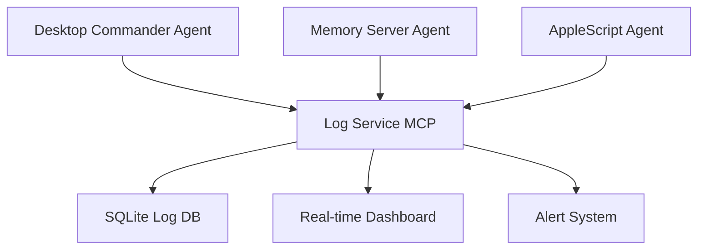

# 📊 Sistema de Monitoramento e Logs MCP - Hub Local Lucas

## 3️⃣ **MONITORAMENTO DE FERRAMENTAS - LOGS VIA MCP**

### **🏗️ Arquitetura de Logging**


### **📡 Agentes de Monitoramento Especializados**

#### **3.1 Desktop Commander Agent**
```python
class DesktopCommanderAgent:
    """Monitor especializado para Desktop Commander MCP"""
    
    def __init__(self, orchestrator):
        self.orchestrator = orchestrator
        self.last_check = datetime.now()
        self.command_history = []
        
    async def monitor_commands(self):
        """Monitorar comandos executados via Desktop Commander"""
        while True:
            try:
                # Verificar comandos executados desde último check
                recent_commands = await self.get_recent_commands()
                
                for command in recent_commands:
                    log_entry = {
                        "agent": "desktop_commander",
                        "event_type": "command_executed",
                        "timestamp": datetime.now(),
                        "data": {
                            "command": command["command"],
                            "exit_code": command["exit_code"],
                            "duration_ms": command["duration"],
                            "output_size": len(command["output"]),
                            "working_directory": command["cwd"],
                            "success": command["exit_code"] == 0
                        },
                        "severity": "error" if command["exit_code"] != 0 else "info"
                    }
                    
                    # Enviar para Log Service via MCP
                    await self.send_log_to_service(log_entry)
                    
                self.last_check = datetime.now()
                await asyncio.sleep(30)  # Check a cada 30 segundos
                
            except Exception as e:
                await self.send_log_to_service({
                    "agent": "desktop_commander", 
                    "event_type": "monitor_error",
                    "timestamp": datetime.now(),
                    "data": {"error": str(e)},
                    "severity": "error"
                })

    async def send_log_to_service(self, log_entry: dict):
        """Enviar entrada de log para o serviço dedicado via MCP"""
        await self.orchestrator.mcp_client.call_tool(
            "log_service_record_event",
            {
                "log_entry": log_entry,
                "source": "desktop_commander_agent"
            }
        )
```

#### **3.2 Memory Server Agent**
```python
class MemoryServerAgent:
    """Monitor especializado para Memory Server MCP"""
    
    def __init__(self, orchestrator):
        self.orchestrator = orchestrator
        self.entity_count_history = []
        self.relation_count_history = []
        
    async def monitor_memory_changes(self):
        """Monitorar mudanças no grafo de conhecimento"""
        while True:
            try:
                # Verificar estado atual da memória
                memory_stats = await self.get_memory_statistics()
                
                # Detectar mudanças significativas
                changes = await self.detect_significant_changes(memory_stats)
                
                if changes:
                    for change in changes:
                        log_entry = {
                            "agent": "memory_server",
                            "event_type": change["type"], # entity_added, relation_created, etc.
                            "timestamp": datetime.now(),
                            "data": {
                                "change_details": change["details"],
                                "entity_count": memory_stats["entity_count"],
                                "relation_count": memory_stats["relation_count"],
                                "graph_size_mb": memory_stats["size_mb"],
                                "recent_activity": memory_stats["recent_activity"]
                            },
                            "severity": "info"
                        }
                        
                        await self.send_log_to_service(log_entry)
                
                # Monitorar performance da memória
                if memory_stats["response_time_ms"] > 1000:
                    await self.send_log_to_service({
                        "agent": "memory_server",
                        "event_type": "performance_degradation", 
                        "timestamp": datetime.now(),
                        "data": {
                            "response_time_ms": memory_stats["response_time_ms"],
                            "entity_count": memory_stats["entity_count"],
                            "recommendation": "Consider memory optimization"
                        },
                        "severity": "warning"
                    })
                
                await asyncio.sleep(60)  # Check a cada minuto
                
            except Exception as e:
                await self.send_log_to_service({
                    "agent": "memory_server",
                    "event_type": "monitor_error", 
                    "timestamp": datetime.now(),
                    "data": {"error": str(e)},
                    "severity": "error"
                })

    async def get_memory_statistics(self) -> dict:
        """Obter estatísticas do Memory Server"""
        start_time = time.time()
        
        # Usar MCP para obter dados da memória
        entities = await self.orchestrator.mcp_client.call_tool("search_nodes", {"query": "*"})
        graph = await self.orchestrator.mcp_client.call_tool("read_graph", {})
        
        response_time = (time.time() - start_time) * 1000
        
        return {
            "entity_count": len(entities.get("entities", [])),
            "relation_count": len(graph.get("relations", [])),
            "response_time_ms": response_time,
            "size_mb": len(str(graph)) / (1024 * 1024),
            "recent_activity": self.calculate_recent_activity(graph)
        }
```

#### **3.3 System-Wide Monitor Agent**
```python
class SystemMonitorAgent:
    """Monitor geral do sistema Lucas"""
    
    def __init__(self, orchestrator):
        self.orchestrator = orchestrator
        self.thresholds = {
            "cpu_percent": 80,
            "memory_percent": 85, 
            "disk_percent": 90,
            "process_count": 200
        }
    
    async def monitor_system_health(self):
        """Monitorar saúde geral do sistema"""
        while True:
            try:
                system_stats = await self.get_system_statistics()
                
                # Verificar thresholds
                alerts = []
                for metric, value in system_stats.items():
                    if metric in self.thresholds and value > self.thresholds[metric]:
                        alerts.append({
                            "metric": metric,
                            "value": value,
                            "threshold": self.thresholds[metric],
                            "severity": "warning" if value < self.thresholds[metric] * 1.1 else "critical"
                        })
                
                # Log system stats
                log_entry = {
                    "agent": "system_monitor",
                    "event_type": "system_health_check",
                    "timestamp": datetime.now(),
                    "data": {
                        "stats": system_stats,
                        "alerts": alerts,
                        "overall_health": "healthy" if not alerts else "degraded"
                    },
                    "severity": "critical" if any(a["severity"] == "critical" for a in alerts) else "info"
                }
                
                await self.send_log_to_service(log_entry)
                
                await asyncio.sleep(120)  # Check a cada 2 minutos
                
            except Exception as e:
                await self.send_log_to_service({
                    "agent": "system_monitor",
                    "event_type": "monitor_error",
                    "timestamp": datetime.now(), 
                    "data": {"error": str(e)},
                    "severity": "error"
                })
```

### **🎯 Log Service Dedicado**

#### **3.4 Centralized Log Service**
```python
class LogServiceAgent:
    """Serviço centralizado de logging para o Hub"""
    
    def __init__(self, orchestrator):
        self.orchestrator = orchestrator
        self.db = orchestrator.db
        self.alert_rules = self.load_alert_rules()
        self.dashboard_clients = []
        
    @mcp_tool
    async def record_event(self, log_entry: dict, source: str) -> dict:
        """Registrar evento de log (chamado via MCP por outros agentes)"""
        
        # Enriquecer entrada de log
        enriched_entry = {
            **log_entry,
            "id": str(uuid.uuid4()),
            "source": source,
            "hub_timestamp": datetime.now(),
            "lucas_user_id": "lucas-cardoso"  # Sempre Lucas na Fase A
        }
        
        # Salvar no banco
        await self.save_to_database(enriched_entry)
        
        # Verificar regras de alerta
        alerts = await self.check_alert_rules(enriched_entry)
        
        # Notificar dashboard em tempo real
        await self.notify_dashboard_clients(enriched_entry)
        
        # Processar alertas se necessário
        if alerts:
            await self.process_alerts(alerts, enriched_entry)
        
        return {
            "logged": True,
            "log_id": enriched_entry["id"],
            "alerts_triggered": len(alerts)
        }
    
    @mcp_tool
    async def query_logs(self, filters: dict = None, limit: int = 100) -> dict:
        """Consultar logs com filtros"""
        
        query = "SELECT * FROM logs WHERE lucas_user_id = 'lucas-cardoso'"
        params = []
        
        if filters:
            if "agent" in filters:
                query += " AND agent = ?"
                params.append(filters["agent"])
            
            if "severity" in filters:
                query += " AND severity = ?"
                params.append(filters["severity"])
                
            if "event_type" in filters:
                query += " AND event_type = ?"
                params.append(filters["event_type"])
                
            if "since" in filters:
                query += " AND timestamp >= ?"
                params.append(filters["since"])
        
        query += f" ORDER BY timestamp DESC LIMIT {limit}"
        
        results = await self.db.fetchall(query, params)
        
        return {
            "logs": [dict(row) for row in results],
            "total_found": len(results),
            "filters_applied": filters or {}
        }
    
    @mcp_tool
    async def get_dashboard_summary(self) -> dict:
        """Obter resumo para dashboard do Lucas"""
        
        # Últimas 24 horas
        since_24h = datetime.now() - timedelta(hours=24)
        
        summary_query = """
        SELECT 
            agent,
            severity,
            COUNT(*) as count,
            MAX(timestamp) as last_event
        FROM logs 
        WHERE lucas_user_id = 'lucas-cardoso' 
        AND timestamp >= ?
        GROUP BY agent, severity
        ORDER BY agent, severity
        """
        
        results = await self.db.fetchall(summary_query, [since_24h])
        
        # Organizar por agente
        agent_summary = {}
        for row in results:
            agent = row["agent"]
            if agent not in agent_summary:
                agent_summary[agent] = {"total": 0, "by_severity": {}, "last_event": None}
                
            agent_summary[agent]["total"] += row["count"]
            agent_summary[agent]["by_severity"][row["severity"]] = row["count"]
            
            if not agent_summary[agent]["last_event"] or row["last_event"] > agent_summary[agent]["last_event"]:
                agent_summary[agent]["last_event"] = row["last_event"]
        
        # Alertas ativos
        active_alerts = await self.get_active_alerts()
        
        return {
            "period": "last_24_hours",
            "agent_summary": agent_summary,
            "active_alerts": active_alerts,
            "system_health": await self.calculate_system_health(),
            "generated_at": datetime.now()
        }

    async def save_to_database(self, log_entry: dict):
        """Salvar entrada de log no SQLite"""
        await self.db.execute("""
            INSERT INTO logs (
                id, agent, event_type, timestamp, data, severity, 
                source, hub_timestamp, lucas_user_id
            ) VALUES (?, ?, ?, ?, ?, ?, ?, ?, ?)
        """, (
            log_entry["id"],
            log_entry["agent"], 
            log_entry["event_type"],
            log_entry["timestamp"],
            json.dumps(log_entry["data"]),
            log_entry["severity"],
            log_entry["source"],
            log_entry["hub_timestamp"],
            log_entry["lucas_user_id"]
        ))
```

### **📨 Formato das Mensagens de Log MCP**

#### **3.5 Estrutura Padrão de Log Entry**
```json
{
  "id": "log_20250528_193500_001",
  "agent": "desktop_commander",
  "event_type": "command_executed",
  "timestamp": "2025-05-28T19:35:00.123Z",
  "hub_timestamp": "2025-05-28T19:35:00.456Z", 
  "lucas_user_id": "lucas-cardoso",
  "source": "desktop_commander_agent",
  "severity": "info", // info, warning, error, critical
  "data": {
    "command": "ls -la /Users/lucascardoso/apps/MCP/",
    "exit_code": 0,
    "duration_ms": 45,
    "output_size": 2048,
    "working_directory": "/Users/lucascardoso/apps/MCP/",
    "success": true
  }
}
```

#### **3.6 Exemplos de Mensagens por Agente**

##### **Desktop Commander:**
```json
{
  "agent": "desktop_commander",
  "event_type": "file_written",
  "data": {
    "file_path": "/Users/lucascardoso/apps/MCP/luaraujo-livro-app copy/src/components/Chapter4Screen.js",
    "file_size": 15672,
    "lines_changed": 25,
    "backup_created": true,
    "operation": "edit_block"
  },
  "severity": "info"
}
```

##### **Memory Server:**
```json
{
  "agent": "memory_server", 
  "event_type": "entity_created",
  "data": {
    "entity_name": "nested-scroll-fix-solution",
    "entity_type": "solution",
    "relations_created": 3,
    "context_project": "luaraujo",
    "graph_size_after": 47
  },
  "severity": "info"
}
```

##### **System Monitor:**
```json
{
  "agent": "system_monitor",
  "event_type": "performance_alert", 
  "data": {
    "metric": "cpu_percent",
    "current_value": 85.2,
    "threshold": 80.0,
    "process_causing": "node (expo)",
    "recommendation": "Consider restarting Expo dev server"
  },
  "severity": "warning"
}
```

### **🎛️ Dashboard Integration**

#### **3.7 Real-time Dashboard Updates**
```python
# Dashboard recebe updates via WebSocket
class DashboardConnector:
    def __init__(self, log_service):
        self.log_service = log_service
        self.websocket_clients = []
    
    async def notify_dashboard_clients(self, log_entry: dict):
        """Notificar clientes do dashboard em tempo real"""
        dashboard_message = {
            "type": "log_update",
            "timestamp": datetime.now(),
            "data": {
                "agent": log_entry["agent"],
                "event_type": log_entry["event_type"],
                "severity": log_entry["severity"],
                "summary": self.create_summary(log_entry),
                "requires_attention": log_entry["severity"] in ["warning", "error", "critical"]
            }
        }
        
        # Enviar para todos os clientes conectados (Lucas)
        for client in self.websocket_clients:
            await client.send(json.dumps(dashboard_message))
    
    def create_summary(self, log_entry: dict) -> str:
        """Criar resumo legível do log entry"""
        agent = log_entry["agent"].replace("_", " ").title()
        event = log_entry["event_type"].replace("_", " ")
        
        if log_entry["severity"] == "error":
            return f"❌ {agent}: {event} failed"
        elif log_entry["severity"] == "warning":
            return f"⚠️ {agent}: {event} needs attention"
        else:
            return f"✅ {agent}: {event} completed"
```

## 🎯 **BENEFÍCIOS DO SISTEMA DE LOGGING MCP**

1. **Centralização**: Todos os logs em um local
2. **Tempo Real**: Dashboard atualizado instantaneamente  
3. **Estruturação**: Formato consistente de mensagens
4. **Filtragem**: Queries flexíveis por agente/severidade/tempo
5. **Alertas**: Regras configuráveis de notificação
6. **Rastreabilidade**: Cada evento linkado ao contexto do Lucas
7. **Performance**: SQLite otimizado para consultas rápidas
