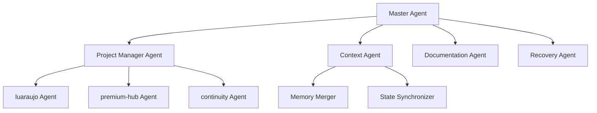

# 🚀 MCP Continuity Server - Plano de Transformação Completa

## 🎯 PROBLEMA IDENTIFICADO
- ❌ Chat Streamlit não funciona com Claude Desktop
- ❌ Usuários preferem integração nativa MCP
- ❌ Falta agentes inteligentes para automação
- ❌ Contextos isolados entre projetos

## 📋 PLANO DE APRIMORAMENTO

### 🔧 FASE 1: MCP Server Nativo (4 semanas)

#### 1.1 Transformação Arquitetural
```typescript
// claude_desktop_config.json
{
  "mcpServers": {
    "continuity": {
      "command": "node",
      "args": ["mcp-continuity-server.js"],
      "cwd": "/path/to/mcp-continuity-service"
    }
  }
}
```

#### 1.2 MCP Server Implementation
- **Protocol**: Implementar MCP Protocol completo
- **Tools**: Definir ferramentas disponíveis para Claude
- **Resources**: Contextos e projetos como recursos MCP
- **Prompts**: Templates para diferentes cenários

#### 1.3 Ferramentas MCP Essenciais
```javascript
const tools = [
  "continuity_recover",      // Recuperar contexto automaticamente
  "project_switch",          // Alternar entre projetos
  "emergency_freeze",        // Congelar estado atual
  "context_merge",           // Mesclar contextos de projetos
  "agent_deploy",            // Implantar agente específico
  "cross_project_search",    // Buscar entre todos os projetos
  "auto_documentation"       // Documentar automaticamente
];
```

### 🤖 FASE 2: Agentes Inteligentes Multi-Projeto (6 semanas)

#### 2.1 Agent Architecture (A2A - Agent-to-Agent)


#### 2.2 Agentes Especializados
- **Master Agent**: Coordena todos os outros agentes
- **Project Agents**: Um para cada projeto (luaraujo, premium-hub, etc.)
- **Context Agent**: Mantém contexto global entre projetos
- **Recovery Agent**: Detecta e resolve inconsistências
- **Documentation Agent**: Auto-documenta decisões e mudanças

#### 2.3 A2A Communication Protocol
```javascript
// Comunicação entre agentes
const agentMessage = {
  from: "luaraujo-agent",
  to: "context-agent", 
  type: "context_update",
  payload: {
    projectId: "luaraujo",
    changes: [...],
    timestamp: "2025-05-28T19:30:00Z"
  }
};
```

### 🧠 FASE 3: ADK (Agent Development Kit) (4 semanas)

#### 3.1 Agent Framework
- **Template System**: Criar novos agentes facilmente
- **Behavior Definition**: DSL para definir comportamentos
- **Learning System**: Agentes aprendem com interações
- **Plugin Architecture**: Extensibilidade via plugins

#### 3.2 ADK Components
```python
# Exemplo de criação de agente
from mcp_continuity_adk import Agent, Behavior, Context

class CustomProjectAgent(Agent):
    def __init__(self, project_name):
        super().__init__(f"{project_name}-agent")
        self.context = Context(project_name)
    
    @Behavior.on_trigger("code_change")
    async def handle_code_change(self, change):
        await self.notify_other_agents(change)
        await self.update_documentation()
```

### 🌐 FASE 4: Contexto Global Unificado (3 semanas)

#### 4.1 Global Context Manager
- **Cross-Project Memory**: Contexto compartilhado entre projetos
- **Dependency Tracking**: Rastrear dependências entre projetos
- **Timeline Global**: Linha do tempo unificada de todos os projetos
- **Knowledge Graph**: Grafo de conhecimento interconectado

#### 4.2 Context Synchronization
```javascript
// Sincronização automática de contextos
const globalContext = {
  projects: {
    "luaraujo": { status: "active", progress: 85% },
    "premium-hub": { status: "paused", progress: 70% },
    "continuity": { status: "active", progress: 95% }
  },
  dependencies: [
    { from: "luaraujo", to: "premium-hub", type: "integration" },
    { from: "continuity", to: "*", type: "infrastructure" }
  ],
  globalState: "development_active"
};
```

## 🎯 IMPLEMENTAÇÃO TÉCNICA

### 📦 Nova Estrutura do Projeto
```
mcp-continuity-server/
├── src/
│   ├── mcp/
│   │   ├── server.ts          # MCP Server principal
│   │   ├── tools/             # Ferramentas MCP
│   │   └── resources/         # Recursos MCP
│   ├── agents/
│   │   ├── master.ts          # Master Agent
│   │   ├── project/           # Project-specific agents
│   │   ├── context/           # Context management
│   │   └── recovery/          # Recovery agents
│   ├── adk/
│   │   ├── framework.ts       # Agent framework
│   │   ├── templates/         # Agent templates
│   │   └── behaviors/         # Behavior definitions
│   └── context/
│       ├── global.ts          # Global context manager
│       ├── sync.ts            # Context synchronization
│       └── graph.ts           # Knowledge graph
├── tools/
│   └── install-mcp.sh         # Script instalação Claude Desktop
└── config/
    └── claude_desktop_example.json
```

### 🔌 Integração Claude Desktop
```bash
# Script de instalação automática
./tools/install-mcp.sh
# Adiciona automaticamente ao claude_desktop_config.json
# Configura paths e permissões
# Testa conectividade MCP
```
