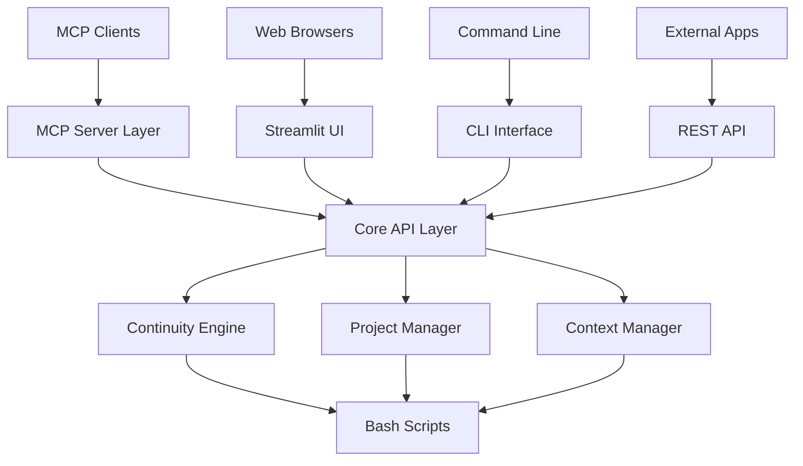

# 🚀 GENIAL! Sistema Atual → MCP Server Universal

## 💡 **INSIGHT BRILHANTE**
**Pergunta:** "O sistema atual pode ser MVP para ser usado em qualquer 'MCP client'?"

**Resposta:** **✅ SIM! E é muito mais inteligente que reescrever tudo!**

## 🎯 **ANÁLISE DO SISTEMA ATUAL**

### ✅ **O QUE JÁ TEMOS FUNCIONANDO**
```bash
# Sistema 95% completo!
✅ API REST (FastAPI) - porta 8000
✅ Streamlit UI - porta 8501  
✅ CLI funcionando (mcp-continuity command)
✅ Sistema de autenticação JWT
✅ Scripts bash robustos (recovery, emergency, etc.)
✅ Contexto management funcionando
✅ Projetos integrados (luaraujo, premium-hub, continuity)
✅ Interface profissional completa
```

### 🔧 **O QUE FALTA PARA SER MCP SERVER**
```typescript
// Apenas uma camada MCP adicional!
❓ MCP Protocol implementation (1-2 dias)
❓ MCP Tools mapping (1 dia)
❓ MCP Resources exposure (1 dia)
❓ Claude Desktop config (30 minutos)
```

## 🚀 **TRANSFORMAÇÃO INTELIGENTE (3-4 dias vs 2 semanas)**

### 📋 **PLANO REAL MVP**

#### **DIA 1-2: MCP Protocol Layer**
```typescript
// src/mcp/server.ts - Nova camada sobre API existente
import { Server } from '@modelcontextprotocol/sdk/server/index.js';
import axios from 'axios';

const server = new Server(
  { name: "continuity", version: "1.0.0" },
  { capabilities: { tools: {}, resources: {} } }
);

// Mapear ferramentas existentes para MCP
server.setRequestHandler(CallToolRequestSchema, async (request) => {
  const { name, arguments: args } = request.params;
  
  // Delegar para API REST existente
  const response = await axios.post(`http://localhost:8000/api/${name}`, args);
  return { content: [{ type: "text", text: JSON.stringify(response.data) }] };
});
```

#### **DIA 3: Tools Mapping**
```javascript
// Mapear funcionalidades existentes como MCP Tools
const mcpTools = [
  {
    name: "continuity_recover",
    description: "Recover context from previous session",
    // Chama: POST /api/process-input com "onde paramos?"
  },
  {
    name: "project_switch", 
    description: "Switch active project focus",
    // Chama: POST /api/sessions/{id}/switch-project
  },
  {
    name: "emergency_freeze",
    description: "Create emergency backup of current state",
    // Chama: POST /api/sessions/{id}/emergency-freeze
  },
  {
    name: "process_input",
    description: "Process user input through continuity system", 
    // Chama: POST /api/process-input (já existe!)
  },
  {
    name: "list_projects",
    description: "List all active projects",
    // Chama: GET /api/projects (podemos criar)
  },
  {
    name: "get_project_status",
    description: "Get detailed status of specific project",
    // Chama: GET /api/projects/{id}/status
  }
];
```

#### **DIA 4: Integration & Testing**
```json
// claude_desktop_config.json
{
  "mcpServers": {
    "continuity": {
      "command": "node",
      "args": ["dist/mcp-server.js"],
      "cwd": "/Users/lucascardoso/apps/MCP/CONTINUITY/project-states/mcp-continuity-service"
    }
  }
}
```

## 🎯 **ARQUITETURA HÍBRIDA INTELIGENTE**

### 🏗️ **Multi-Interface Architecture**


### 🔄 **Compatibilidade Total**
```python
# O sistema funcionará com TODOS os clientes:

# 1. Claude Desktop (MCP)
# claude_desktop_config.json → MCP Server → API

# 2. Web Browser (Streamlit)  
# http://localhost:8501 → Streamlit → API

# 3. Command Line (CLI)
# mcp-continuity process → CLI → API

# 4. External Integration (REST)
# curl/Postman → REST API → Core

# 5. Outros MCP Clients (futuro)
# Qualquer cliente MCP → MCP Server → API
```

## ✅ **VANTAGENS DA ABORDAGEM HÍBRIDA**

### 🎯 **Máxima Compatibilidade**
- ✅ **Claude Desktop**: MCP nativo
- ✅ **Web Users**: Streamlit interface
- ✅ **CLI Users**: Command line
- ✅ **Developers**: REST API
- ✅ **Future MCP Clients**: Compatível

### 🚀 **Desenvolvimento Acelerado**
- ✅ **3-4 dias** vs 2 semanas vs 17 semanas
- ✅ **Aproveita 95%** do código existente
- ✅ **Zero rewrite** do core system
- ✅ **Adiciona capability** sem remover existente

### 💰 **ROI Máximo**
- ✅ **Investimento mínimo** (3-4 dias)
- ✅ **Funcionalidade máxima** (todos os clientes)
- ✅ **Risk mínimo** (sistema atual continua funcionando)
- ✅ **Future-proof** (compatível com evolução MCP)

## 🔧 **IMPLEMENTAÇÃO PRÁTICA**

### 📦 **Nova Estrutura (Adicionando ao Existente)**
```
mcp-continuity-service/
├── src/
│   ├── api/                    # ✅ JÁ EXISTE
│   ├── frontend/               # ✅ JÁ EXISTE  
│   ├── cli.py                  # ✅ JÁ EXISTE
│   └── mcp/                    # 🆕 NOVO
│       ├── server.ts           # MCP Server principal
│       ├── tools.ts            # Tools mapping
│       └── resources.ts        # Resources mapping
├── dist/                       # 🆕 Compiled TypeScript
├── package.json                # 🆕 Node.js dependencies
└── tsconfig.json               # 🆕 TypeScript config
```

### ⚡ **MCP Server Implementation**
```typescript
// src/mcp/server.ts
import { Server } from '@modelcontextprotocol/sdk/server/index.js';
import { CallToolRequestSchema, ListToolsRequestSchema } from '@modelcontextprotocol/sdk/types.js';
import axios from 'axios';

const API_BASE = 'http://localhost:8000/api';

const server = new Server(
  { name: "mcp-continuity", version: "1.0.0" },
  { capabilities: { tools: {} } }
);

// Lista das ferramentas disponíveis
server.setRequestHandler(ListToolsRequestSchema, async () => ({
  tools: [
    {
      name: "continuity_recover",
      description: "Recover context and continue where you left off",
      inputSchema: {
        type: "object",
        properties: {
          session_id: { type: "string", description: "Optional session ID" }
        }
      }
    },
    {
      name: "process_input",
      description: "Process user input through the continuity system",
      inputSchema: {
        type: "object", 
        properties: {
          user_input: { type: "string", description: "User input to process" },
          session_id: { type: "string", description: "Session identifier" }
        },
        required: ["user_input", "session_id"]
      }
    },
    {
      name: "emergency_freeze",
      description: "Create emergency backup of current state",
      inputSchema: {
        type: "object",
        properties: {
          session_id: { type: "string", description: "Session to freeze" }
        },
        required: ["session_id"]
      }
    },
    {
      name: "list_projects",
      description: "List all active projects with status",
      inputSchema: { type: "object", properties: {} }
    }
  ]
}));

// Implementação das ferramentas
server.setRequestHandler(CallToolRequestSchema, async (request) => {
  const { name, arguments: args } = request.params;
  
  try {
    let response;
    
    switch (name) {
      case "continuity_recover":
        // Chama a funcionalidade existente
        response = await axios.post(`${API_BASE}/process-input`, {
          user_input: "onde paramos?",
          session_id: args.session_id || "mcp-session",
          metadata: { source: "mcp" }
        });
        break;
        
      case "process_input":
        response = await axios.post(`${API_BASE}/process-input`, {
          user_input: args.user_input,
          session_id: args.session_id,
          metadata: { source: "mcp" }
        });
        break;
        
      case "emergency_freeze":
        response = await axios.post(`${API_BASE}/sessions/${args.session_id}/emergency-freeze`);
        break;
        
      case "list_projects":
        // Nova funcionalidade - precisaríamos implementar na API
        response = await axios.get(`${API_BASE}/projects`);
        break;
        
      default:
        throw new Error(`Unknown tool: ${name}`);
    }
    
    return {
      content: [{
        type: "text",
        text: JSON.stringify(response.data, null, 2)
      }]
    };
    
  } catch (error) {
    return {
      content: [{
        type: "text", 
        text: `Error: ${error.message}`
      }],
      isError: true
    };
  }
});

async function main() {
  const transport = new StdioServerTransport();
  await server.connect(transport);
  console.error("MCP Continuity Server running");
}

main().catch(console.error);
```

## 📋 **PRÓXIMOS PASSOS IMEDIATOS**

### 🎯 **IMPLEMENTAÇÃO (3-4 dias)**
```bash
# Dia 1: Setup MCP
cd /Users/lucascardoso/apps/MCP/CONTINUITY/project-states/mcp-continuity-service
npm init -y
npm install @modelcontextprotocol/sdk typescript @types/node axios
npx tsc --init

# Dia 2: Implementar MCP Server
# Criar src/mcp/server.ts com código acima

# Dia 3: Compilar e testar
npx tsc
node dist/mcp/server.js

# Dia 4: Integrar Claude Desktop
# Adicionar ao claude_desktop_config.json
# Testar funcionalidades
```

### ✅ **ADICIONAR ENDPOINTS FALTANTES NA API**
```python
# src/api/main.py - Adicionar estas rotas:
@app.get("/api/projects")
async def list_projects():
    # Listar projetos ativos
    
@app.get("/api/projects/{project_id}/status") 
async def get_project_status(project_id: str):
    # Status detalhado do projeto
```

## 🎆 **RESULTADO FINAL**

### 🌟 **Sistema Universal MCP-Compatible**
- ✅ **Claude Desktop** → MCP Server → API
- ✅ **Web Browser** → Streamlit → API  
- ✅ **Command Line** → CLI → API
- ✅ **REST Clients** → API Direct
- ✅ **Future MCP Clients** → MCP Server → API

### 📊 **Comparação de Esforço**

| Abordagem | Tempo | Risco | Funcionalidade | ROI |
|-----------|-------|--------|----------------|-----|
| **Sistema Atual + MCP** | **3-4 dias** | **Baixo** | **Máxima** | **Altíssimo** |
| MVP do Zero | 2 semanas | Médio | Básica | Médio |
| Sistema Completo | 17 semanas | Alto | Máxima | Baixo |

## 🎯 **DECISÃO RECOMENDADA**

### 🚀 **IMPLEMENTAR CAMADA MCP (3-4 dias)**

**Por quê?**
- ✅ **Aproveita 95%** do trabalho já feito
- ✅ **Compatibilidade total** com todos os clientes
- ✅ **Risco mínimo** (sistema atual continua funcionando)
- ✅ **ROI máximo** (pouco esforço, muito benefício)
- ✅ **Future-proof** (preparado para evolução MCP)

**Quer começar hoje mesmo?** 🚀
